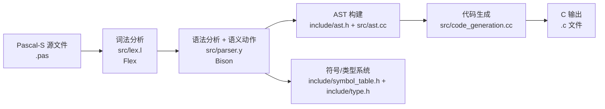
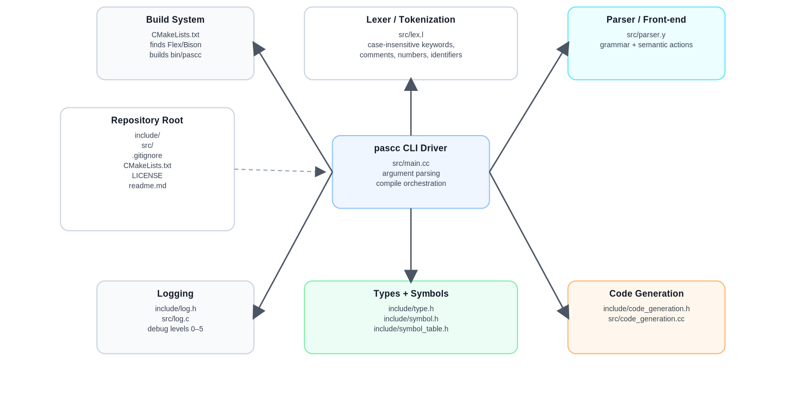
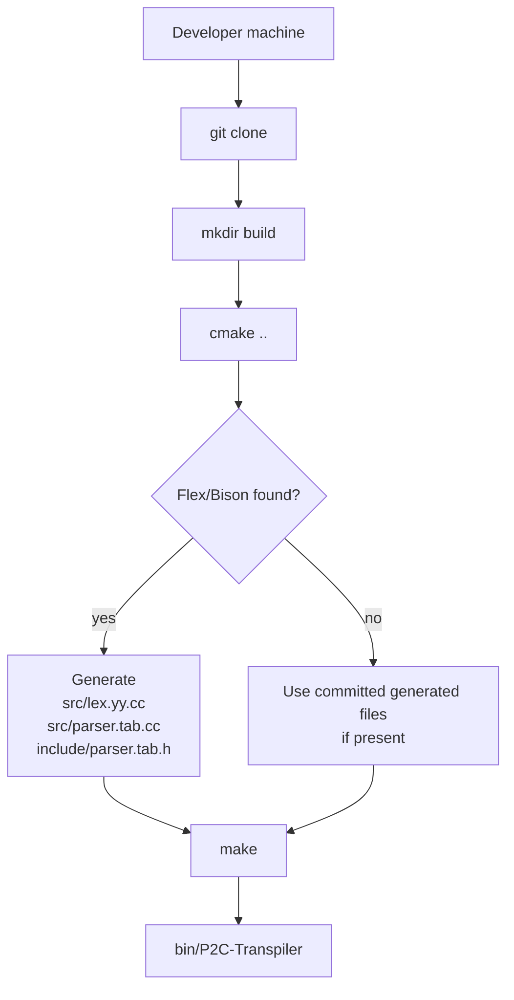
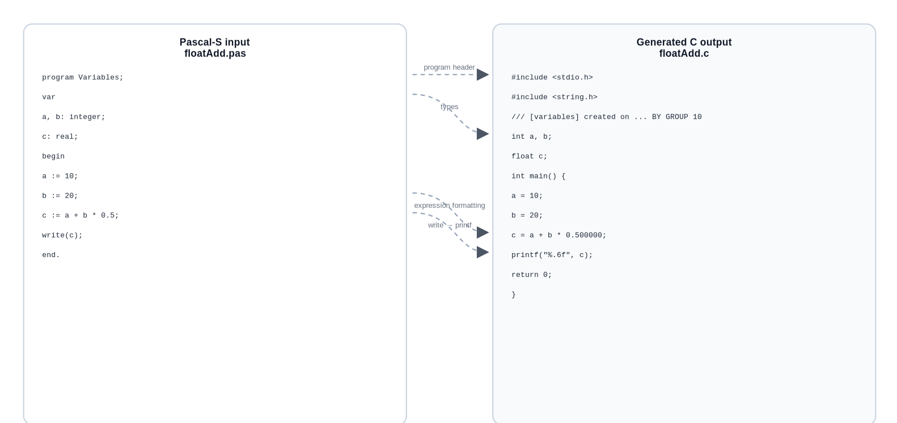

<a id="en"></a>

# P2C-Transpiler — Pascal-S to C Transpiler

Bilingual README (English first, then 简体中文).  
Quick link: **[简体中文](#zh-cn)**

## Executive Summary

**P2C-Transpiler** is a Pascal-S → C transpiler implemented in C++ with Flex and Bison. It provides a CLI executable (`P2C-Transpiler`) that reads a Pascal-S source file, performs lexical + syntax analysis, conducts semantic checks while building an AST, and finally emits C source code.

Key facts:
- The build system is **CMake-based** and generates/uses Flex/Bison outputs (`src/lex.yy.cc`, `src/parser.tab.cc`, `include/parser.tab.h`) and builds the executable into `bin/`.
- The CLI supports `-i/--input`, `-o/--output`, `-d/--debug`, `-h/--help`, with default input `test.pas`, default debug level `3`, and output naming logic implemented in `src/main.cc`.
- Automated tests/CI are **not present** in the current repo tree; testing is currently performed manually.

## Background and Motivation

The project goal is to design and implement a Pascal-to-C compiler/transpiler that:
- accepts Pascal-S source code as input,
- performs lexical analysis, syntax analysis, semantic analysis,
- reports lexical/syntax/static-semantic errors with as much detail as possible,
- and if there are no static errors, performs syntax-directed translation to generate equivalent C code.

This intent matches the repository’s “About” description (“Pascal-S to C transpiler… complete lexical, syntax, and semantic analysis… AST-based C code generation”).

## Getting Started

### Repository Layout

At the top level, the repository contains `include/`, `src/`, plus `CMakeLists.txt`, `LICENSE`, and `readme.md`.

The source and header directory listings (primary source) are visible in the repo tree:
- `include/`: `ast.h`, `code_generation.h`, `log.h`, `parser.h`, `parser.tab.h`, `symbol.h`, `symbol_table.h`, `type.h`.
- `src/`: `ast.cc`, `code_generation.cc`, `lex.l`, `lex.yy.cc`, `log.c`, `main.cc`, `parser.tab.cc`, `parser.y`, `symbol.cc`, `type.cc`.

> Note: The `bin/` and `build/` directories are build artifacts and are explicitly ignored by `.gitignore`.

### Requirements

**Build-time requirements:**
- CMake ≥ 3.1 (`cmake_minimum_required(VERSION 3.1)`)
- Flex and Bison are searched via `find_package(FLEX)` / `find_package(BISON)` and used to generate lexer/parser outputs when available.
- A C++ compiler; the CMake script sets Linux-oriented flags including `-D__linux__`.

**Validated environment:**
- WSL2 Ubuntu 22.04
- Flex 2.6.1, Bison 3.0.4
- CMake 3.28.2
- C++11

**OS constraints**
- The CMake configuration explicitly prints “Linux” and defines `__linux__`, implying Linux/WSL as the primary target.

### Build and Install

This project is built from source; **no package registry / installer is defined** (unspecified).

```bash
git clone https://github.com/Rand0MGG/P2C-Transpiler.git
cd P2C-Transpiler

rm -rf build
mkdir build
cd build

cmake ..
make
```

- The executable output directory is configured as `.../bin` by CMake (`set(CMAKE_RUNTIME_OUTPUT_DIRECTORY ...)`).
- `.gitignore` ignores `build/` and `bin/`, confirming these are intended as generated artifacts rather than source-controlled outputs.

### Quick CLI Usage

From the repo’s existing `readme.md` and the CLI help text implemented in `src/main.cc`:

```bash
./bin/P2C-Transpiler [-i inputfile] [-o outputfile] [-d debuglevel] [-h|--help]
```

Defaults:
- Input defaults to `test.pas` (`string input_file = "test.pas";`).
- Debug defaults to `3` (`int debug_level = 3;`).
- If output is not provided, a default is derived from the input name; additional `.c` handling is performed (see next section).

## Architecture and Implementation

### High-Level Data Flow

The pipeline implemented across `src/main.cc`, `src/lex.l`, `src/parser.y`, AST modules, and `src/code_generation.cc` is:



Primary entrypoints:
- `main()` parses CLI args and calls compilation.
- `CompilePascalFile()` sets `yyin` via `yyinput(...)`, invokes `yyparse(&ast)`, then calls `GenerateCodeFromAST(...)`.
- `GenerateCodeFromAST()` writes to `<out_file_path>.c` (or stdout when no out path is provided) and calls `CodeGenerator::FormatProgram(ast_tree, dst)`.

### Module and File Responsibilities



This table is intended to be “clickable” for maintainers: it enumerates *exact file paths* and what each component does (primary sources: repo tree + code).

| Module | File path(s) | Responsibility |
|---|---|---|
| Build | `CMakeLists.txt` | Find Flex/Bison, generate lexer/parser outputs, compile and link `P2C-Transpiler`, emit to `bin/`, set Linux flags |
| CLI driver | `src/main.cc` | Parse args, set debug level, compute output naming, run `yyparse`, call code generator, write output file |
| Lexer | `src/lex.l` | Tokenization rules, keyword/identifier handling, comment rules, line/column tracking, lexical error reporting |
| Parser / grammar | `src/parser.y` | Grammar productions, AST construction, symbol-table scope management, semantic error reporting |
| Parser interface | `include/parser.h` | Declares `YYSTYPE` and semantic value structures used by Bison actions |
| Generated parser header | `include/parser.tab.h` | Bison-generated token definitions and parser interface |
| AST definitions | `include/ast.h` | AST node classes, grammar-type enums, `AST` holder with `Valid()` and `libs()` helper |
| AST implementation | `src/ast.cc` | AST node methods; notably `ExpressionListNode::FormatString()` and variable list formatting helpers |
| Types | `include/type.h`, `src/type.cc` | Basic types (int/real/bool/char), arrays, records; operation/type rules via `operation_map`; init/release lifecycle |
| Symbols and scopes | `include/symbol.h`, `include/symbol_table.h`, `src/symbol.cc` | Symbol objects (variables/const/functions) and scope chain (`TableSet`) for insert/search and shadowing rules |
| Code generation | `include/code_generation.h`, `src/code_generation.cc` | Emit C source; include std headers; map Pascal standard functions to C macros/defs; format statements like `read/write` into `scanf/printf` |
| Logging | `include/log.h`, `src/log.c` | Embedded C logging library (log levels TRACE…FATAL) and `log_set_level(...)` |
| Repo docs | `readme.md` | Minimal CLI usage summary |
| License | `LICENSE` | MIT License |

### Language Support and I/O Contract

**Input language:** Pascal-S (subset). The lexer defines keywords such as `program`, `const`, `var`, `function`, `procedure`, `begin/end`, `if/then/else`, `while`, `for/to/downto/do`, `read`, `write`, and types `integer/real/boolean/char`.

**Notable lexer behavior:**
- Case-insensitive scanning is enabled (`%option case-insensitive`), and identifiers are normalized to lowercase in `process_identifier()` via `std::transform(..., ::tolower)`.
- Comments are supported in `{ ... }` and `// ...` forms (`ANNO_1`, `ANNO_2`).
- Lexical error handling includes “illegal character”, unclosed `{}`, and unclosed quotes, with colored terminal output including line/column.

**Output:** C source code written to `<output>.c` through `fopen(out_file_path + ".c", "w")`.

**Output file naming (important implementation detail):**
- If `-o` is omitted, `src/main.cc` sets `out = <input_without_ext> + ".c"` (or `<input> + ".c"` if no extension), then strips a trailing `.c` so that `GenerateCodeFromAST` can append `.c` again.
- Users should pass an output basename without the `.c` extension.

### Semantic Checks and Type Rules

The parser maintains:
- `lex_error_flag` (extern) and `semantic_error_flag`, plus `error_flag` for syntax errors.
- A scope stack (`table_set_queue`) and `TableSet` instances per function/procedure scope; it inserts symbols and emits semantic errors on redefinitions.

Examples of semantic checks visible in `src/parser.y`:
- **Boolean condition checks** for `if` and `while` (`TYPE_BOOL` required).
- **Undeclared loop variable** detection in `for` statements.
- **Type compatibility** issues reported as “incompatible type assigning …”.
- `read(...)` / `write(...)` require “basic type” arguments (enforced via `set_types(...)`).

The type system defines global singleton basic types (`TYPE_INT`, `TYPE_REAL`, `TYPE_BOOL`, `TYPE_CHAR`, etc.) and uses an `operation_map` to resolve operator result types.

### Code Generation Highlights

**C includes and stdlib shims**
- Generated output includes `#include <stdio.h>` and `#include <string.h>`, and conditionally includes `<math.h>` when math functions are used.
- The code generator tracks called Pascal library functions via a `lib_map_` of macros/defs and toggles inclusion using `Call(...)`.

**`read` / `write` lowering**
- `read`/`readln` are printed as `scanf("%s", ...)` using `VariableListNode::FormatString()`.
- `write`/`writeln` are printed as `printf(...)` using `ExpressionListNode::FormatString()`, where real values use `%.6f`.

**Partial implementation note**
- `include/ast.h` and `src/code_generation.cc` contain enum cases and formatting logic for `READLN`, `WRITELN`, `CASE`, `REPEAT`.
- However, the lexer (`src/lex.l`) does **not** define tokens for `readln`, `writeln`, `case`, `repeat`, `until` (as of the current repo), so these features may be unreachable/unfinished through the front-end.
- `repeat-until` and related constructs are currently design intents rather than fully implemented features in the frontend.

### Build and Compilation Pipeline Diagram



This reflects `CMakeLists.txt` generation targets and the configured runtime output directory.

## Developer Guide

### Configuration Options

P2C-Transpiler does not define a config file; configuration is via CLI flags only (unspecified beyond CLI).

**CLI flags and behavior:**
- `-h/--help`: print usage and exit.
- `-i/--input`: input Pascal-S file, default `test.pas`.
- `-o/--output`: output basename; `.c` is handled as described above.
- `-d/--debug`: integer 0..5; invalid values error out.

**Debug level mapping**
- The CLI presents `0: QUIET ... 5: TRACE` and defaults to `3`.
- Implementation detail: `log_set_level(5 - debug_level)` reverses the user-facing scale vs the embedded logger’s enum order.
- `yydebug_(level)` sets `yydebug = (level == 5)`, enabling Bison/Flex debug at “TRACE” only.

### Usage Examples With Expected Output

#### Example 1 — Real arithmetic

**Input (Pascal-S)**

```pascal
program Variables;
var
a, b: integer;
c: real;
begin
a := 10;
b := 20;
c := a + b * 0.5;
write(c);
end.
```

**Generated output (C)**

The transpiler generates C code similar to the following (date in header is runtime-dependent and will differ on your machine).  

```c
#include <stdio.h>
#include <string.h>
/// [variables] created on 2025/5/25 BY GROUP 10
int a, b;
float c;
int main() {
a = 10;
b = 20;
c = a+b*0.500000;
printf("%.6f", c);
return 0;
}
```


Why `printf("%.6f", ...)`? Because `ExpressionListNode::FormatString()` formats real as `%.6f`.

**Expected runtime output**
- `20.000000` (computed from `10 + 20 * 0.5`).

#### Example 2 — Conditionals

The transpiler also supports `if/else` structures, generating C code with corresponding nested `if` blocks and `else` blocks.  

Type checking for `if` conditions is enforced in the grammar actions: the `expression` must be `TYPE_BOOL`, otherwise a semantic error is emitted.

### Testing

**Repository state**
- There is no `tests/` directory in the current repo tree.
- No releases are published, and the repo shows a single commit in history.

**Testing Methodology**
- Testing is divided into categories: correct programs, lexical tests, syntax tests, and semantic tests.
- Run `./bin/P2C-Transpiler -i procedure.pas` to test an example.

**Suggested minimal test workflow (recommended)**
1. Create `examples/` (not present; would be a new folder) and add `.pas` cases.
2. Run `./bin/P2C-Transpiler -i <case>.pas -o <case_out>` and compile the emitted C with `gcc`/`clang`.
3. Compare stdout with expected values.

### Contribution Guide

The project currently has no CONTRIBUTING file.

Recommended contribution process:
1. Fork the repository on GitHub and create a feature branch.
2. Keep changes small and focused; include `.pas` input and expected `.c` output snippets in PR description.
3. Prefer changes backed by new regression tests (even if implemented as a simple script initially).
4. When touching grammar/lexer:
   - update `src/lex.l` and `src/parser.y`,
   - regenerate `lex.yy.cc` / `parser.tab.cc` / `parser.tab.h` to keep committed generated files consistent.

## Project Metadata and References

### License

- The repository license is **MIT**.
- The embedded logging library indicates MIT licensing terms in its header comments.

### Known Limitations

**Design reflections:**
- **Unary vs binary minus ambiguity** (e.g., `a- -4`) is described as a difficult case due to how unary minus is handled.
- **Empty procedure parameter list** `procedure foo();` recognition issues are a known problem that may require grammar changes.

### Troubleshooting and FAQ

**Build fails: Flex/Bison not found**
- Symptom: CMake cannot generate lexer/parser outputs.
- What the repo does: generation is conditional on `FLEX_FOUND AND BISON_FOUND`.
- Workarounds:
  - Install Flex/Bison, or
  - Ensure the committed generated files (`src/lex.yy.cc`, `src/parser.tab.cc`, `include/parser.tab.h`) exist and are compatible with your toolchain.

**Output file name confusion**
- If you pass `-o out.c`, `src/main.cc` strips `.c` and later appends `.c` again when opening the file. Final output should still be `out.c`.

**Lexer reports colored “error” messages**
- This is expected: `print_lex_error` prints ANSI color codes and includes `(line,column)` plus a message and offending text.

### Changelog Summary

- No releases are published in the repository, and the visible history is “1 Commit” (as of 2026-03-26).
- No `CHANGELOG.md` exists in the root file listing.

### References

Repository (primary):
- https://github.com/Rand0MGG/P2C-Transpiler

Primary implementation files referenced in this README:
- `CMakeLists.txt`
- `src/main.cc`
- `src/lex.l`
- `src/parser.y`
- `include/ast.h`, `src/ast.cc`
- `include/type.h`, `src/type.cc`
- `include/symbol_table.h`
- `src/code_generation.cc`
- `LICENSE`

### Documentation Assets and Images

This README intentionally embeds Mermaid diagrams inline. For better portability (and for platforms that do not render Mermaid), it is recommended to **export diagrams to SVG/PNG** and store them under:

- `docs/images/`

**Recommended file naming**
- Use kebab-case, include diagram purpose, and format:
  - `flow-transpilation-pipeline.svg`
  - `arch-modules-overview.svg`
  - `build-steps-flow.svg`
  - `example-floatAdd-input-output.svg`

<a id="zh-cn"></a>

## 中文说明

返回: **[English](#en)**

### 执行摘要

**P2C-Transpiler** 是一个用 C++ + Flex + Bison 实现的 Pascal-S → C 转译器。它提供命令行可执行文件 `P2C-Transpiler`：读取 Pascal-S 源文件，进行词法分析与语法分析，在构建 AST 的同时完成静态语义检查，最终生成等价的 C 源码文件。

关键点：
- 构建系统基于 CMake，会（在 Flex/Bison 可用时）生成/使用 `src/lex.yy.cc`、`src/parser.tab.cc`、`include/parser.tab.h`，并将 `P2C-Transpiler` 输出到 `bin/`。
- CLI 参数包含 `-i/--input`、`-o/--output`、`-d/--debug`、`-h/--help`，默认输入 `test.pas`、默认调试级别 `3`，输出文件名逻辑在 `src/main.cc` 中实现。
- 目前仓库树中没有自动化测试目录或 CI 配置；目前的测试以手工测试为主。

### 背景与动机

本项目的目标是实现一个 Pascal 到 C 的编译/转译程序：输入 Pascal-S 源码，完成词法/语法/语义分析；对错误程序给出尽可能详细的报错；对无静态错误的程序执行语法制导翻译生成等价 C 代码。

仓库主页的 “About” 描述与该目标一致，强调词法/语法/语义分析与基于 AST 的代码生成。

### 快速开始

#### 依赖与环境

- 需要 CMake ≥ 3.1，并通过 `find_package(FLEX)` / `find_package(BISON)` 查找 Flex/Bison。
- CMake 脚本中明确使用 Linux 相关编译标志（`-D__linux__`），因此建议在 Linux/WSL 环境构建。

验证过的运行环境：
- WSL2 Ubuntu 22.04
- Flex 2.6.1、Bison 3.0.4
- CMake 3.28.2
- C++11

#### 构建

```bash
git clone [https://github.com/Rand0MGG/P2C-Transpiler.git](https://github.com/Rand0MGG/P2C-Transpiler.git)
cd P2C-Transpiler

rm -rf build
mkdir build
cd build

cmake ..
make
```

- `P2C-Transpiler` 输出到 `bin/` 由 CMake 设置。
- `.gitignore` 忽略 `build/` 和 `bin/`，说明它们属于构建产物。

#### 运行

```bash
./bin/P2C-Transpiler [-i inputfile] [-o outputfile] [-d debuglevel] [-h|--help]
```

### 架构与实现

#### 总体流程图


入口实现要点：
- `main()` 解析命令行参数并启动编译。
- `CompilePascalFile()` 调用 `yyinput(...)` 设置输入流，`yyparse(&ast)` 生成 AST，然后进入 `GenerateCodeFromAST(...)`。
- `GenerateCodeFromAST()` 实际写出 `<out>.c` 并调用 `CodeGenerator::FormatProgram(...)`。

#### 模块关系图


#### 编译流程图


#### 语言支持与 I/O 约定

- 词法层面支持的关键字/类型包括 `program/const/var/function/procedure/begin/end/if/then/else/while/for/to/downto/do/read/write` 与 `integer/real/boolean/char` 等。
- 输出为 C 源码，通过 `fopen(out_file_path + ".c", "w")` 写入。
- 输出文件名规则：未指定 `-o` 时根据输入名生成默认 `.c`；用户在命令行参数中应传递不带 `.c` 的输出文件名，代码会统一处理后缀。

#### 读写语句翻译

- `read/readln` 翻译为 `scanf(...)`，格式串来自 `VariableListNode::FormatString()`。
- `write/writeln` 翻译为 `printf(...)`，格式串来自 `ExpressionListNode::FormatString()`；`real` 默认输出为 `%.6f`。

### 使用示例与期望输出

#### 示例一 浮点运算

以下是实数算术的输入 Pascal-S 与输出 C 示例。


该示例中 `write(c)` 输出 `printf("%.6f", c)`，与 AST 的格式串实现一致。

### 许可证与参考

- 许可证为 MIT。
- 参考仓库：https://github.com/Rand0MGG/P2C-Transpiler